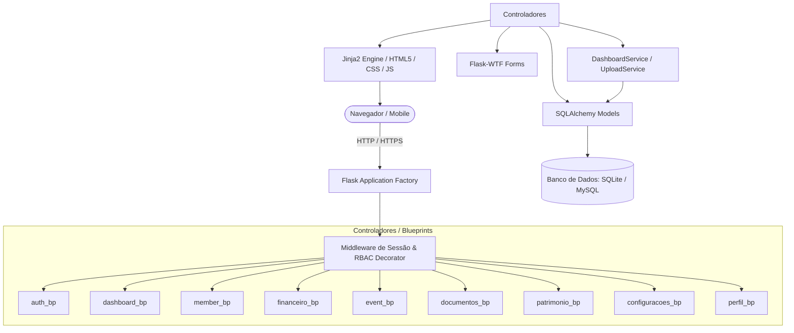
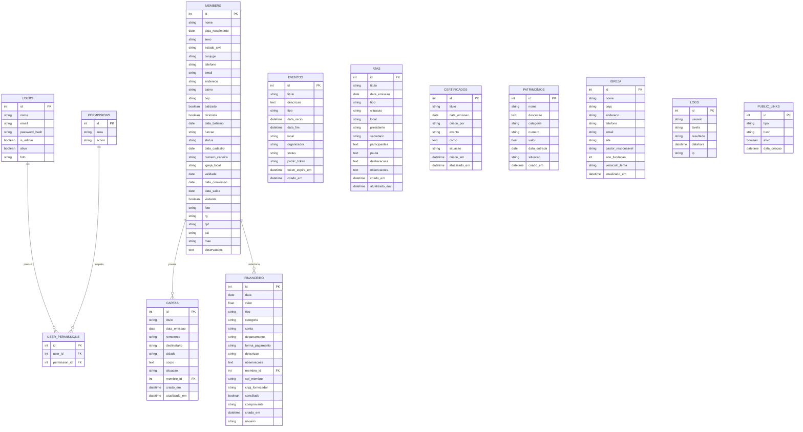

# DOCUMENTAÇÃO TÉCNICA E FUNCIONAL DO SISTEMA SIGI
**SiGI &mdash; Sistema Integrado de Gestão de Igreja**

---

## 1. Visão Geral
O **SiGI (Sistema Integrado de Gestão de Igreja)** é uma aplicação web completa desenvolvida em **Python/Flask**, projetada para suprir as demandas administrativas, pastorais, financeiras e eclesiásticas de congregações e igrejas locais.

O sistema integra em um único ambiente:
- **Secretaria e Membresia:** Cadastro completo, histórico de batismo, dízimo, cargos, emissão de carteirinhas e fichas em PDF.
- **Tesouraria e Finanças:** Controle de entradas, saídas com comprovantes, dízimos, conciliação e balancetes contábeis.
- **Eventos e Cultos:** Agenda de atividades, lembretes por e-mail e páginas públicas de divulgação com links compartilháveis.
- **Documentos Eclesiásticos:** Livro de atas de reuniões, cartas pastorais de recomendação/transferência e certificados com impressão formatada.
- **Patrimônio:** Controle de inventário de bens móveis, imóveis, veículos e equipamentos com valorização patrimonial.
- **Segurança e Controle de Acesso:** Matriz de permissões granular por área/ação com proteção de visualização e dados no backend e frontend.

---

## 2. Escopo da Documentação
Esta documentação abrange todos os módulos, arquivos de código-fonte, modelos de banco de dados, controladores, serviços, rotas, formulários e templates existentes no repositório.

---

## 3. Estado do Sistema Analisado
- **Data da Análise:** 28/08/2026
- **Branch Ativa:** `feature/melhorias-sigi`
- **Commit Analisado:** `82eef54f43988b329cdfd57ad8960be19af85f77`
- **Ambiente de Referência:** Python 3.12 (venv local), Flask Development Server / WSGI Apache (`app.wsgi`), SQLite (`sigi.db`) / MySQL (`PyMySQL`).

---

## 4. Controle de Versão
A documentação reflete o estado do código registrado nos repositórios `rafaelmaciels/sigi` e `soarespaullo/sigi`.

---

## 5. Arquitetura do Sistema

### 5.1. Padrão Arquitetural
O sistema utiliza a arquitetura **MVC modular com Application Factory Pattern**, separando responsabilidades entre:
1. **Modelos (ORM):** Mapeamento via SQLAlchemy das entidades do banco.
2. **Controladores (Blueprints):** Rotas HTTP organizadas por domínio funcional.
3. **Serviços (Services):** Regras de negócio complexas e agregações (ex: `DashboardService`, `UploadService`).
4. **Formulários (WTForms):** Sanitização e validação de requisições web.
5. **Visões (Jinja2 Templates):** Camada de apresentação responsiva com Bootstrap 5 e Chart.js.



---

## 6. Tecnologias e Dependências

| Pacote | Versão | Finalidade |
| :--- | :--- | :--- |
| **Flask** | >= 3.0 | Framework web central |
| **Werkzeug** | >= 3.0 | Utilitários HTTP, WSGI e hashing seguro de senhas |
| **Jinja2** | >= 3.1 | Motor de templates para renderização do frontend |
| **Flask-SQLAlchemy** | >= 3.1 | Mapeamento Objeto-Relacional (ORM) |
| **Flask-Migrate** | >= 4.0 | Controle de migrações de banco de dados via Alembic |
| **PyMySQL** | >= 1.1 | Driver de conexão para banco de dados MySQL |
| **Flask-Login** | >= 0.6 | Gerenciamento de autenticação, usuários e sessões |
| **Flask-WTF** | >= 1.2 | Integração de formulários com proteção contra CSRF |
| **cryptography** | >= 42.0 | Criptografia de dados e tokens |
| **Flask-Mail** | >= 0.9 | Envio de mensagens de e-mail via SMTP |
| **WeasyPrint** | >= 62.0 | Conversão de HTML/CSS para documentos PDF |
| **python-dotenv** | >= 1.0 | Carregamento de variáveis de ambiente a partir do `.env` |
| **Bootstrap** | 5.3 | Framework de layout e componentes responsivos |
| **Chart.js** | 3.9 | Renderização de gráficos interativos na Dashboard |

---

## 7. Estrutura de Diretórios do Projeto

```text
c:\xampp\htdocs\sigi\
├── app/
│   ├── __init__.py               # Criação do app (create_app) e injeção de contexto Jinja2
│   ├── extensions.py             # Instâncias globais: db, login_manager, migrate, mail, csrf
│   ├── decorators.py             # Decorator de autorização @permission_required
│   ├── models/                   # Modelos de dados SQLAlchemy
│   │   ├── user.py               # User, Permission, UserPermission
│   │   ├── member.py             # Member, PublicLink
│   │   ├── financeiro.py         # Financeiro
│   │   ├── evento.py             # Evento
│   │   ├── documento.py          # Ata, Certificado, Carta
│   │   ├── patrimonio.py         # Patrimonio
│   │   ├── igreja.py             # Igreja
│   │   ├── log.py                # Log
│   │   └── permissions_helper.py # Helper global has_permission()
│   ├── routes/                   # Controladores (Blueprints)
│   │   ├── auth/                 # Login, logout, setup, recuperação de senha
│   │   ├── dashboard/            # Painel executivo e métricas da igreja
│   │   ├── member/               # Gestão de membros, carteirinhas, aniversariantes
│   │   ├── financeiro/           # Entradas, saídas, balancetes, extratos
│   │   ├── event/                # Calendário de eventos, lembretes, link público
│   │   ├── documentos/           # Atas, cartas pastorais, emissão de certificados
│   │   ├── patrimonio/           # Bens e inventário patrimonial
│   │   ├── configuracoes/        # Usuários, Matriz de Permissões, Backup, Logs, E-mail
│   │   └── perfil/               # Meu perfil e alteração de senha
│   ├── services/                 # Serviços de suporte
│   │   ├── dashboard_service.py  # Métricas e cálculos agregados da Dashboard
│   │   └── upload_service.py     # Upload e validação de imagens e comprovantes
│   ├── static/                   # Arquivos estáticos (CSS, JS, Fonts, Uploads)
│   └── templates/                # Templates HTML organizados por módulo
├── scripts/                      # Scripts auxiliares de testes e povoamento de dados
│   ├── seed_financeiro.py        # Povoamento de lançamentos financeiros
│   ├── seed_documentos_eventos.py# Povoamento de eventos, atas, cartas e certificados
│   ├── seed_patrimonio.py        # Povoamento de bens patrimoniais
│   └── test_permissions.py       # Suíte de testes automatizados de permissões
├── config.py                     # Configurações de ambientes (Development, Production)
├── requirements.txt              # Declaração de dependências do projeto
└── run.py                        # Inicializador da aplicação local
```

---

## 8. Módulos e Funcionalidades

### 8.1. Autenticação & Acesso (`auth_bp`)
- **Login (`/login`):** Autenticação por e-mail e senha com hash salted via `check_password_hash`.
- **Logout (`/logout`):** Encerramento seguro da sessão ativa.
- **Primeiro Acesso (`/setup`):** Criação do primeiro usuário Administrador quando a tabela `users` está vazia.
- **Recuperação de Senha (`/forgot_password` e `/reset_password/<token>`):** Geração de token com expiração de 1 hora enviado por e-mail.

### 8.2. Painel Executivo (`dashboard_bp`)
- **Dashboard (`/dashboard`):**
  - **Administrador (`is_admin=True`):** Acesso completo aos cards de Fluxo do Mês, Crescimento da Membresia, Movimentação Anual, Gráfico de Batismo, Histórico Financeiro dos Últimos 6 Meses, Membros Ativos, Eventos e Aniversariantes.
  - **Usuários Comuns (`is_admin=False`):** Exibição exclusiva de Membros Ativos, Eventos Programados e Aniversariantes do Mês. Dados sensíveis não são calculados nem trafegados pelo backend.

### 8.3. Secretaria & Membresia (`member_bp`)
- **Listagem e Busca (`/membros/`, `/membros/buscar`):** Listagem com busca por nome, telefone e e-mail.
- **Cadastro e Edição (`/membros/cadastro`, `/membros/editar/<id>`):** Dados pessoais, filiação, endereço, batismo, dízimo, foto e cargo.
- **Documentos do Membro:**
  - Emissão de Carteirinha Digital (`/membros/carteira/<id>`).
  - Ficha Cadastral em PDF (`/membros/membro/<id>/ficha/pdf`).
  - Carta de Recomendação (`/membros/carta_recomendacao/<id>`).
- **Aniversariantes (`/membros/aniversariantes`, `/membros/aniversariantes/pdf`):** Relatório de aniversariantes do mês em tela e PDF.
- **Relatório Estatístico (`/membros/relatorio`, `/membros/relatorio/pdf`):** Relatório restrito para Administradores.
- **Cadastro Externo de Visitantes (`/membros/cadastro-visitante/<hash>`):** Formulário público para novos visitantes.

### 8.4. Tesouraria & Finanças (`financeiro_bp`)
- **Visão Geral (`/financeiro/`):** Indicadores de saldo, receitas e despesas.
- **Entradas e Saídas (`/financeiro/entradas`, `/financeiro/saidas`):** Lançamentos com categorias, departamentos, contas bancárias e anexos de comprovantes.
- **Dízimos (`/financeiro/dizimos`, `/financeiro/dizimos/extrato/<membro_id>`):** Controle de dízimos por membro com emissão de extrato individual.
- **Balancete Mensal (`/financeiro/balancete`):** Balancete contábil discriminado.
- **Exportação (`/financeiro/export.csv`):** Exportação dos dados financeiros em CSV.

### 8.5. Eventos & Cultos (`event_bp`)
- **Calendário (`/eventos/`):** Programação de cultos, conferências, retiros e reuniões.
- **Página Pública (`/eventos/publico/<public_token>`):** Página sem necessidade de login com layout responsivo, detalhes do evento e botões de compartilhamento via WhatsApp e cópia de link.
- **Lembretes por E-mail (`/eventos/enviar-lembretes`):** Disparo em lote de notificações para membros com eventos nos próximos 3 dias.

### 8.6. Documentos Eclesiásticos (`documentos_bp`)
- **Livro de Atas (`/documentos/atas/`):** Atas com registros de presidente, secretário, pauta e deliberações.
- **Cartas Pastorais (`/documentos/cartas/`):** Cartas de recomendação, transferência, convite e viagem missionária.
- **Emissão de Certificados (`/documentos/certificados/`):** Certificados de batismo, consagração e cursos ministeriais com layout de diploma, botão de impressão rápida e envio por WhatsApp.

### 8.7. Patrimônio (`patrimonio_bp`)
- **Bens Cadastrados (`/patrimonios/`):** Controle de imóveis, veículos, móveis e equipamentos com número de tombamento e situação.
- **Inventário Geral (`/patrimonios/inventario`):** Relatório consolidado com cálculo do valor patrimonial total da igreja.

### 8.8. Configurações & Administração (`configuracoes_bp`)
- **Usuários do Sistema (`/configuracoes/usuarios/`):** Cadastro, edição, alteração de status e exclusão de operadores.
- **Matriz de Permissões (`/configuracoes/permissoes/`):** Atribuição de permissões de visualização, criação, edição e exclusão por módulo.
- **Dados da Igreja (`/configuracoes/igreja/`):** Razão social, CNPJ, dados de contato e pastor titular.
- **Backup (`/configuracoes/backup/`):** Cópia de segurança do banco de dados para download.
- **Auditoria de Logs (`/configuracoes/logs/`):** Trilha de auditoria das ações realizadas pelos usuários.
- **Configurações de E-mail (`/configuracoes/mail/`):** Configuração dos parâmetros de conexão SMTP.

### 8.9. Perfil do Operador (`perfil_bp`)
- **Meu Perfil (`/perfil/`, `/perfil/editar`, `/perfil/senha`):** Atualização de dados pessoais, foto de avatar e alteração de senha.

---

## 9. Banco de Dados e Dicionário de Dados

### 9.1. Diagrama Entidade-Relacionamento (ERD)



---

## 10. Regras de Negócio e Matriz de Permissões (RBAC)

### 10.1. Princípio de Autorização
1. **Administradores (`User.is_admin == True`):**
   - Acesso irrestrito a todos os módulos, rotas, relatórios e painéis executivos.
2. **Usuários Comuns (`User.is_admin == False`):**
   - O acesso é bloqueado por padrão e concedido exclusivamente através da tabela associativa `user_permissions`.
   - Na Dashboard, os 6 cards e gráficos financeiros/estatísticos são ocultados no frontend e seus dados são zerados no backend.

### 10.2. Áreas e Ações da Matriz de Permissões
- **Áreas:** `membros`, `financeiro`, `eventos`, `atas`, `cartas`, `certificados`, `patrimonios`, `usuarios`, `config`, `mail`, `perfil`.
- **Ações:** `view` (visualizar), `create` (cadastrar), `edit` (editar), `delete` (excluir).

---

## 11. Autenticação e Segurança

- **Senhas:** Armazenamento seguro utilizando hash com salt via `werkzeug.security.generate_password_hash`.
- **Sessões:** Proteção de sessão com `Flask-Login` e cookies com flag `HttpOnly`.
- **Proteção contra CSRF:** `Flask-WTF CSRFProtect` ativo em formulários `POST`.
- **Uploads:** Sanitização de nomes de arquivos com `secure_filename` e validação estrita de extensões permitidas.
- **Trilha de Auditoria:** Gravação automática de logs de operações com IP e identificador do usuário na tabela `logs`.

---

## 12. Matriz de Rastreabilidade Técnica

| Funcionalidade | Rota | Controller | Service / Modelo | Tabela | Arquivo Fonte |
| :--- | :--- | :--- | :--- | :--- | :--- |
| **Login** | `POST /login` | `auth.login` | Flask-Login / User | `users`, `logs` | `app/routes/auth/auth.py` |
| **Dashboard** | `GET /dashboard` | `dashboard.dashboard` | `DashboardService` | `members`, `financeiro`, `eventos` | `app/routes/dashboard/dashboard.py` |
| **Membros** | `GET /membros/` | `member.listar_membros` | Member Query | `members` | `app/routes/member/member.py` |
| **Carteirinha** | `GET /membros/carteira/<id>` | `member.carteira_membro` | Member Query | `members` | `app/routes/member/member.py` |
| **Ficha PDF** | `GET /membros/membro/<id>/ficha/pdf` | `member.imprimir_ficha_pdf` | WeasyPrint | `members`, `igreja` | `app/routes/member/member.py` |
| **Receitas** | `POST /financeiro/entradas` | `financeiro.entradas` | Financeiro | `financeiro`, `logs` | `app/routes/financeiro/financeiro.py` |
| **Despesas** | `POST /financeiro/saidas` | `financeiro.saidas` | Financeiro / Upload | `financeiro`, `logs` | `app/routes/financeiro/financeiro.py` |
| **Balancete** | `GET /financeiro/balancete` | `financeiro.balancete_mensal` | Financeiro Aggregations | `financeiro` | `app/routes/financeiro/financeiro.py` |
| **Eventos** | `POST /eventos/novo` | `event.novo_evento` | Evento | `eventos`, `logs` | `app/routes/event/event.py` |
| **Página Evento**| `GET /eventos/publico/<token>` | `event.evento_publico_token`| Evento Token | `eventos` | `app/routes/event/event.py` |
| **Atas** | `POST /documentos/atas/nova` | `documentos.atas.nova_ata` | Ata | `atas`, `logs` | `app/routes/documentos/atas/atas.py` |
| **Cartas** | `POST /documentos/cartas/nova` | `documentos.cartas.nova_carta`| Carta | `cartas` | `app/routes/documentos/cartas/cartas.py` |
| **Certificados** | `GET /documentos/certificados/<id>`| `documentos.certificados.visualizar_certificado`| Certificado | `certificados` | `app/routes/documentos/certificados/certificados.py` |
| **Patrimônio** | `GET /patrimonios/inventario` | `patrimonio.inventario` | Patrimonio Sum | `patrimonios` | `app/routes/patrimonio/patrimonio.py` |
| **Permissões** | `POST /configuracoes/permissoes/` | `configuracoes.permissoes.permissoes_page` | UserPermission | `permissions`, `user_permissions` | `app/routes/configuracoes/permissoes/permissoes.py` |

---

## 13. Testes Automatizados
O sistema conta com suíte de testes de integração implementada em [`scripts/test_permissions.py`](file:///c:/xampp/htdocs/sigi/scripts/test_permissions.py).

Para executar os testes:
```bash
.\venv\Scripts\python.exe scripts/test_permissions.py
```

---

## 14. Diagnóstico Técnico e Pontos de Atenção
1. **Renderização de PDFs (WeasyPrint):** A geração de arquivos PDF requer bibliotecas gráficas nativas (Pango, Cairo). Em sistemas Windows sem essas DLLs instaladas no sistema, a interface web opera normalmente, mas a conversão direta de PDF pode emitir avisos.
2. **Serviço de E-mail (SMTP):** O envio de lembretes e recuperação de senha requer a configuração de servidor SMTP no arquivo `.env` ou no painel de configurações.

---

## 15. Changelog da Documentação

### 2026-08-28 (Commit `82eef54`)
- **Documentação:** Criação da documentação técnica e funcional completa em arquivo Markdown auditado.
- **Segurança & RBAC:** Implementação de controle de acesso restrito na Dashboard e no backend para usuários comuns.
- **Frontend & UI:** Otimização de tabelas e grids para 100% de largura no desktop e rolagem touch no mobile.
- **Documentos & Certificados:** Adição de layout oficial de diploma, impressão solene e compartilhamento via WhatsApp.
- **Eventos:** Correção de layout e visibilidade do rodapé na página pública de eventos.
- **Povoamento de Dados:** Criação de scripts para dados de finanças, eventos, atas, cartas, certificados e patrimônio.
